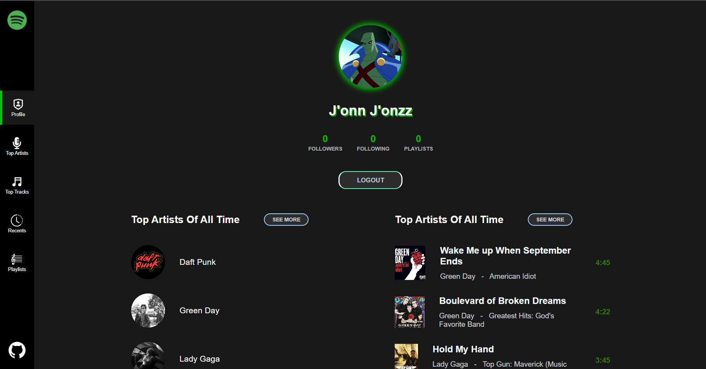
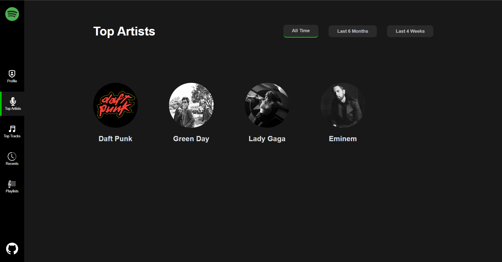
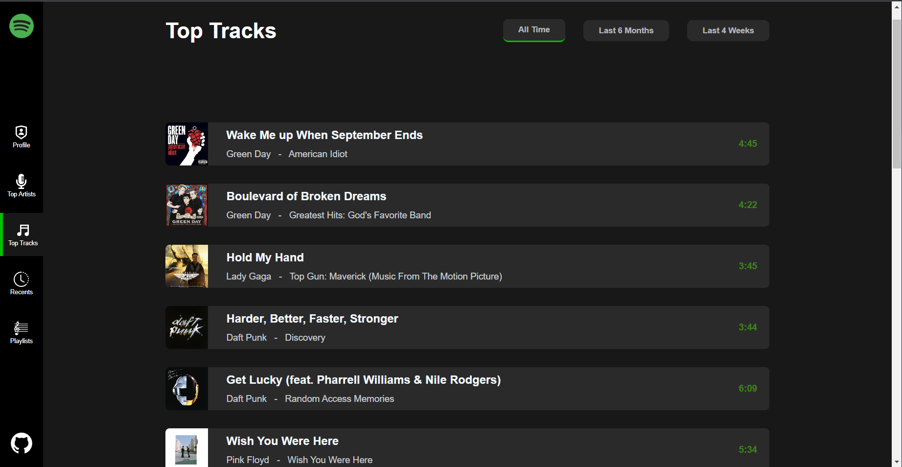
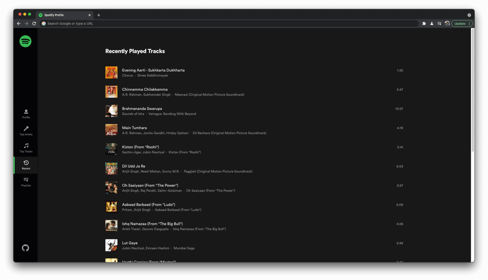
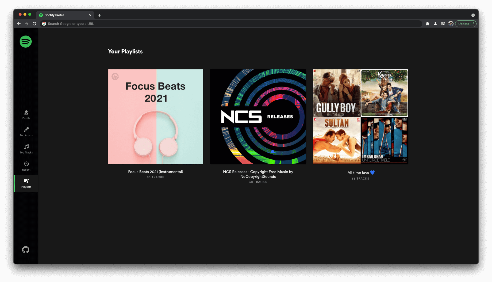

# Spotify Profile App
## https://spotify-profile-app.netlify.app/

 
 
 
We will be creating a Spotify Profile overview app which will fetch a Spotify user's info, recent activity, favorite tracks, favorite artists, and playlists.

You need to use `redux` compulsorily in this project.

This is a group project (2 participants per group). Here is a sample breakdown of the project:

- Project Setup (install Router, Redux, Redux toolkit etc.) (P1)
- Auth Flow setup: Required for other screens (P2)
- Login Page: Layout of the page and on button click link the auth flow (P1)
- Profile Page (P2)
- Top Artists Page with filters (P1)
- Top Tracks Page with filters (P2)

## Screenshots
1. Login Page

2. Profile Page

3. Top Artists Page with filters

4. Top Tracks Page with filters

5. Recent activity (**Stretch**)

6. Playlists (**Stretch**)

